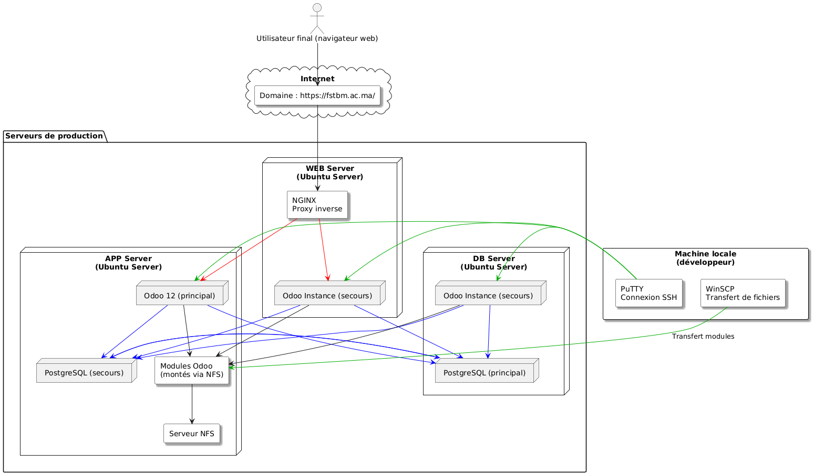
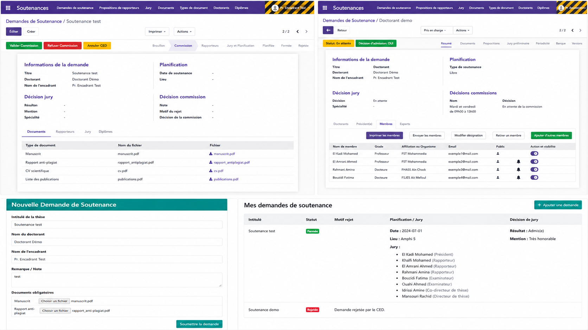
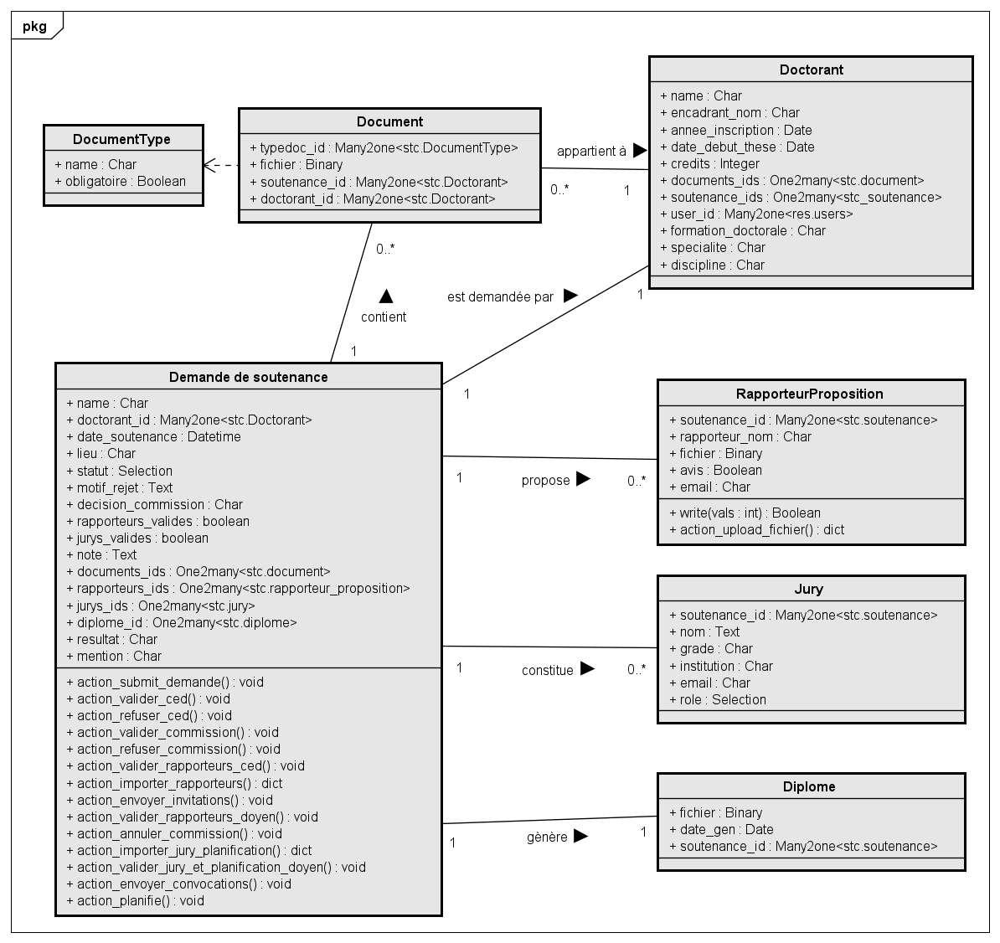

<div align="center">

# 🎓 Gestion des Soutenances de Thèse — Module Odoo 12

**Module ERP Odoo pour la gestion complète du processus de soutenance de thèse de doctorat**

[](https://www.odoo.com/)
[](https://www.python.org/)
[](https://www.postgresql.org/)
[](https://www.gnu.org/licenses/agpl-3.0)

*Projet de Fin d'Études — Aguelloul Mouad*

---

</div>

## 📋 Table des Matières

- [Présentation](#-présentation)
- [Fonctionnalités](#-fonctionnalités)
- [Architecture](#-architecture)
- [Workflow](#-workflow-de-la-soutenance)
- [Captures d'écran](#-captures-décran)
- [Diagrammes UML](#-diagrammes-uml)
- [Installation](#-installation)
- [Configuration](#-configuration)
- [Structure du Module](#-structure-du-module)
- [Technologies](#-technologies-utilisées)
- [Auteurs](#-auteurs)
- [Licence](#-licence)

---

## 🎯 Présentation

Ce module Odoo 12 est une application complète de **gestion des soutenances de thèse de doctorat**, développée dans le cadre d'un Projet de Fin d'Études (PFE). Il automatise l'intégralité du workflow administratif — depuis la soumission de la demande par le doctorant jusqu'à la génération du diplôme final — en centralisant la communication entre tous les acteurs et en produisant automatiquement l'ensemble des documents officiels.

### Objectifs principaux

| Objectif | Description |
|----------|-------------|
| 🔄 **Automatisation** | Workflow complet automatisé : vérifications, validations, notifications, génération documentaire |
| 📊 **Centralisation** | Toutes les opérations dans un seul environnement Odoo |
| 📧 **Communication** | Notifications automatiques par email à chaque étape clé |
| 📄 **Documents officiels** | Génération instantanée de PV, attestations, diplômes et fiches |
| 🔒 **Sécurité** | Contrôle d'accès par rôle, traçabilité complète des actions |
| ⏱️ **Efficacité** | Réduction drastique des délais et suppression des erreurs manuelles |

---

## ✨ Fonctionnalités

### 👨‍🎓 Doctorant
- **Formulaire web** de soumission de demande de soutenance
- Téléversement des documents obligatoires (manuscrit, rapport anti-plagiat, CV, publications)
- **Suivi en temps réel** de l'état de la demande via le portail web
- Consultation des résultats et mention obtenus

### 🏢 Service CED (Centre d'Études Doctorales)
- Vérification et validation des critères d'éligibilité
- Gestion complète des dossiers avec wizards guidés
- **Import Excel** des rapporteurs et membres du jury
- Saisie de la décision de la commission
- Upload des rapports d'évaluation
- Saisie des résultats de soutenance

### 🏛️ Commission de Thèse
- Examen des demandes de soutenance
- Décision d'acceptation ou de rejet avec justification

### 👔 Doyen
- Validation des propositions de rapporteurs (exactement 3 choisis)
- Validation de la composition du jury et de la planification
- Déclenchement des envois automatiques d'invitations/convocations

### 📝 Rapporteurs
- Réception automatique des invitations par email (avec PDF joint)
- Upload des rapports d'évaluation
- Soumission des avis (favorable / défavorable)

### ⚖️ Jury
- Réception des convocations par email (avec PDF joint)
- Consultation des informations de la soutenance

### 📄 Génération de Documents
Le module génère automatiquement de nombreux documents officiels imprimables :

| Document | Description |
|----------|-------------|
| 📋 Formulaire de dossier | Dossier complet de la demande |
| 📝 Fiche de renseignement | Informations détaillées du doctorant |
| ✉️ Invitation rapporteur | Lettre d'invitation officielle |
| 📨 Convocation jury | Convocation officielle des membres du jury |
| 📊 PV de soutenance | Procès-verbal pré/post soutenance |
| 🏆 Attestation de réussite | Attestation délivrée au doctorant |
| 🎓 Attestation de participation jury | Pour les membres du jury |
| 📜 Attestation d'encadrement | Pour le directeur de thèse |
| 🏅 Avis de soutenance | Avis officiel de la soutenance |

---

## 🏗️ Architecture

Le module suit l'architecture **MVC (Model-View-Controller)** d'Odoo :

```
┌─────────────────────────────────────────────────────────────┐
│                    Navigateur Web (Client)                  │
├──────────────────────┬──────────────────────────────────────┤
│   Portail Web        │        Backend Odoo                  │
│   (Doctorant)        │   (CED, Doyen, Admin)                │
├──────────────────────┴──────────────────────────────────────┤
│                  Serveur Odoo 12                            │
│  ┌────────────┐  ┌──────────┐  ┌──────────────┐             │
│  │ Controllers│  │  Models  │  │    Views     │             │
│  │  (Python)  │  │ (Python) │  │   (XML)      │             │
│  └────────────┘  └──────────┘  └──────────────┘             │
│  ┌──────────────┐  ┌─────────────────────────┐              │
│  │   Reports    │  │    Email Templates      │              │
│  │  (XML+Python)│  │      (XML)              │              │
│  └──────────────┘  └─────────────────────────┘              │
├─────────────────────────────────────────────────────────────┤
│              PostgreSQL Database                            │
└─────────────────────────────────────────────────────────────┘
```

### Diagramme de Déploiement

<p align="center">
  
</p>

L'infrastructure de production comprend :
- **Web Server** (Ubuntu) : NGINX en proxy inverse
- **App Server** (Ubuntu) : Instance Odoo 12 principale + instance de secours
- **DB Server** (Ubuntu) : PostgreSQL principal + secours
- **Modules partagés** via NFS entre les serveurs
- Accès développeur via SSH (PuTTY) et transfert de fichiers (WinSCP)

---

## 🔄 Workflow de la Soutenance

Le processus de soutenance suit un workflow précis avec **7 états** :

```
┌───────────┐      ┌────────────┐     ┌──────────────┐      ┌──────────────────────┐
│ Déposée   │────▶│ Commission │────▶│ Rapporteurs  │────▶│ Jury et Planification│
│(Brouillon)│      │            │     │              │      │                      │
└─────┬─────┘      └─────┬──────┘     └──────────────┘      └──────────┬───────────┘
      │                  │                                             │
      │             ┌────▼─────┐                                ┌──────▼──────┐
      │             │ Rejetée  │                                │  Planifiée  │
      │             └──────────┘                                └──────┬──────┘
      │                                                                │
      │                                                         ┌──────▼──────┐
      │                                                         │   Fermée    │
      │                                                         └─────────────┘
      │
      └──────▶ Rejetée (si refus CED)
```

### Étapes détaillées

1. **📥 Déposée** — Le doctorant soumet sa demande via le formulaire web avec les documents obligatoires
2. **🔍 Commission** — Le service CED valide l'éligibilité, puis la commission examine la demande
3. **📋 Rapporteurs** — Import Excel des 6 rapporteurs proposés, choix de 3, validation par le doyen, envoi des invitations
4. **⚖️ Jury et Planification** — Import Excel du jury, définition de la date/lieu, validation par le CED puis le doyen
5. **📅 Planifiée** — La soutenance est programmée, les convocations sont envoyées
6. **✅ Fermée** — Les résultats et la mention sont saisis, les documents finaux sont générés
7. **❌ Rejetée** — La demande a été refusée (avec motif) à l'étape CED ou Commission

---

## 📸 Captures d'écran

<p align="center">
  
</p>
---

## 📐 Diagrammes UML

### Diagramme de Classes

<p align="center">
  
</p>

Le modèle de données est composé des entités principales suivantes :

| Modèle | Description |
|--------|-------------|
| `stc.soutenance` | Entité centrale — Demande de soutenance avec tout le workflow |
| `stc.doctorant` | Informations du doctorant (inscription, encadrant, crédits) |
| `stc.document` | Documents joints à la soutenance (manuscrit, rapports…) |
| `stc.document_type` | Types de documents (obligatoire / optionnel) |
| `stc.rapporteur.proposition` | Propositions de rapporteurs avec avis et fichiers |
| `stc.jury` | Membres du jury avec rôles validés par le CED |
| `stc.personnel` | Personnel universitaire (encadrants, administratifs) |
| `stc.session` | Sessions académiques (ouverte / fermée) |
| `stc.diplome` | Diplôme final généré |
| `stc.specialite` | Spécialités académiques |
| `stc.discipline` | Disciplines de recherche |
| `stc.role` | Rôles des membres du jury |

---

## 🚀 Installation

### Prérequis

- **Odoo 12** Community ou Enterprise
- **Python 3.5+**
- **PostgreSQL 10+**
- Modules Odoo dépendants : `web`, `base`, `mail`, `website`, `portal`

### Étapes d'installation

1. **Cloner le dépôt** dans le répertoire des addons Odoo :
   ```bash
   cd /path/to/odoo/addons
   git clone https://github.com/votre-utilisateur/stc-gestion-soutenances.git stc
   ```

2. **Redémarrer le serveur Odoo** :
   ```bash
   ./odoo-bin -u stc -d votre_base_de_donnees
   ```

3. **Activer le module** :
   - Aller dans *Applications* → Rechercher « Gestion des Soutenances »
   - Cliquer sur **Installer**

4. **Configurer les groupes d'utilisateurs** (voir section Configuration)

---

## ⚙️ Configuration

### Groupes de Sécurité

Le module définit 3 groupes d'utilisateurs avec des permissions différentes :

| Groupe | Permissions | Description |
|--------|-------------|-------------|
| **Service CED** | Lecture, Écriture, Création, Suppression | Gestion complète des dossiers |
| **Encadrant** | Lecture seule | Consultation des soutenances de ses doctorants |
| **Doyen** | Lecture seule | Validation via les wizards dédiés |
| **Administrateur** | Toutes | Gestion système complète |

### Configuration Initiale

1. **Créer les types de documents** obligatoires (Manuscrit, Rapport anti-plagiat, CV, Publications…)
2. **Créer une session académique** et l'ouvrir (statut « Ouverte »)
3. **Enregistrer les doctorants** avec leurs encadrants
4. **Configurer les rôles de jury** (Président, Rapporteur, Examinateur, Co-directeur…)
5. **Configurer les templates d'email** dans les paramètres du module

---

## 📁 Structure du Module

```
stc/
├── __init__.py                    # Import des sous-packages
├── __manifest__.py                # Manifeste du module Odoo
│
├── models/                        # Modèles de données (Backend)
│   ├── soutenance.py              # Modèle principal + workflow (511 lignes)
│   ├── doctorant.py               # Gestion des doctorants
│   ├── rapporteur_proposition.py  # Propositions de rapporteurs
│   ├── jury.py                    # Composition du jury
│   ├── document.py                # Documents joints
│   ├── document_type.py           # Types de documents
│   ├── personnel.py               # Personnel universitaire
│   ├── session.py                 # Sessions académiques
│   ├── diplome.py                 # Diplômes générés
│   ├── specialite.py              # Spécialités
│   ├── discipline.py              # Disciplines
│   └── role.py                    # Rôles de jury
│
├── views/                         # Vues XML (Frontend Odoo)
│   ├── soutenance_views.xml       # Vues formulaire/liste de la soutenance
│   ├── soutenance_web_templates.xml # Templates web (portail doctorant)
│   ├── wizard_views.xml           # Vues des wizards (assistants)
│   ├── menu_views.xml             # Menus de navigation
│   └── *.xml                      # Vues des autres modèles
│
├── wizard/                        # Wizards (Assistants guidés)
│   ├── import_rapporteurs_wizard.py
│   ├── import_jury_wizard.py
│   ├── modifier_demande_wizard.py
│   ├── avis_commission_wizard.py
│   ├── entrer_resultat_soutenance_wizard.py
│   ├── pv_global_wizard.py
│   └── ... (20 wizards au total)
│
├── report/                        # Rapports PDF (QWeb)
│   ├── pv_soutenance_template.xml
│   ├── attestation_reussite_doctorant_template.xml
│   ├── attestation_jury_template.xml
│   ├── rapporteur_invitation_template.xml
│   ├── jury_convocation_template.xml
│   └── ... (10+ templates de rapports)
│
├── controllers/                   # Contrôleurs HTTP
│   └── soutenance_portal.py       # Routes web du portail doctorant
│
├── data/                          # Données et templates d'email
│   ├── mail_template_rapporteur_invitation.xml
│   ├── mail_template_jury_convocation.xml
│   └── ... (6 templates d'email)
│
├── security/                      # Contrôle d'accès
│   ├── security.xml               # Groupes (CED, Encadrant, Doyen)
│   └── ir.model.access.csv        # ACL par groupe
│
├── static/
│   ├── description/
│   │   └── icon.png               # Icône du module
│   └── src/
│       ├── rapporteurs.xlsx        # Template Excel pour import rapporteurs
│       └── jury.xlsx              # Template Excel pour import jury
│
└── demo/
    └── demo_doctorant.xml         # Données de démonstration
```

---

## 🛠️ Technologies Utilisées

| Catégorie | Technologie |
|-----------|-------------|
| **ERP** | Odoo 12 Community |
| **Backend** | Python 3, Odoo ORM |
| **Frontend** | XML (QWeb), JavaScript, CSS |
| **Base de données** | PostgreSQL |
| **Serveur web** | NGINX (proxy inverse) |
| **OS Serveur** | Ubuntu Server |
| **Modélisation** | UML (StarUML) |
| **Gestion de projet** | GanttProject |
| **Imports structurés** | Fichiers Excel (.xlsx) via `openpyxl` |
| **Rapports** | QWeb Templates (génération PDF) |
| **Emails** | Templates de mail Odoo |

---

## 👥 Auteurs

| | Nom | Rôle |
|---|------|------|
| 👤 | **Aguelloul Mouad** | Développeur & Auteur du PFE |

---

## 📄 Licence

Ce projet est distribué sous licence **AGPL-3.0** — voir le fichier [LICENSE](https://www.gnu.org/licenses/agpl-3.0.html) pour plus de détails.

---

<div align="center">

*Développé avec ❤️ pour la gestion universitaire*

</div>
